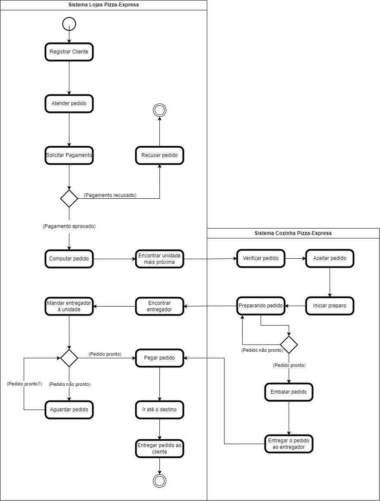

<h2><a href= "https://www.mackenzie.br">Universidade Presbiteriana Mackenzie</a></h2>
<h3><a href= "https://www.mackenzie.br/graduacao/sao-paulo-higienopolis/sistemas-de-informacao">Sistemas de Informação</a></h3>

*&lt;Sistema de entrega Pizza Express&gt;*

**Conteúdo**

- [Autores](#autores)
- [Descrição do Projeto](#descrição-do-projeto)
- [Análise de Requisitos Funcionais e Não-Funcionais](#análise-de-requisitos-funcionais-e-não-funcionais)
- [Diagrama de Atividades](#diagrama-de-atividades)
- [Diagrama de Casos de Uso](#diagrama-de-casos-de-uso)
- [Descrição dos Casos de Uso](#descrição-dos-casos-de-uso)
- [Diagrama de Sequência](#diagrama-de-sequência)
- [Diagrama de Classes](#diagrama-de-classes)
- [Diagrama de Estados](#diagrama-de-estados)
- [Diagrama de Implantação](#diagrama-de-implantação)
- [Referências](#referências)

# Autores

* Arthur Jones Bicalho - 10420317 
* Fernando Seong Jae Yoo - 10332725
* Guilherme Silva Dias - 10427415
* Raffael Rodrigues Esteves - 10420414
* Tamires Mendes da Silva - 10420266

# Descrição do Projeto

Uma rede de fast-food composta por 40 unidades pertencentes ao Pizza-Express está 
enfrentando problemas devido a menor eficiência nas entregas, comprometendo seus lucros em 
30%. A queda de receita está atrelada ao serviço ofertado pelo seu principal concorrente que se 
mostrou mais ágil nas entregas por realizá-las em até 30 minutos, enquanto nas redes do Pizza Express leva-se uma hora. Os computadores utilizados atualmente pela rede Pizza-Express não 
contam com funções de processamento e entrega dos pedidos, ficando limitado somente as 
operações usuais do negócio.

Para solucionar o problema é necessário desenvolver um sistema que seja capaz de 
localizar as lojas da rede Pizza-Express que estão mais próximas do cliente e outra aplicação 
para operá-las. O objetivo é tornar as entregas do Pizza-Express mais ágeis e diminuir o tempo 
de entrega para menos de 30 minutos, possibilitando que o negócio entre em um cenário mais 
competitivo em relação ao seu principal concorrente.

# Análise de Requisitos Funcionais e Não-Funcionais
Requisitos Funcionais: 

Sistema de cadastro para o cliente.  
Disponibilização do cardápio.  
Suporte a pagamento via cartão e pix.  
SIstema de conexão entre lojas Pizza-Express e Fábrica Pizza-Express com base no endereço fornecido pelo cliente.  
Sistema de gerenciamento de pedidos para Fábrica Pizza-Express.  
Solicitação de serviços de entrega.  
Processo de segurança aos dados do cliente.  

Requisitos Não-Funcionais

Solicitar o pedido do cliente para a Fábrica mais próxima do endereço registrado.  
Sistema desenvolvido de forma simples com foco na praticidade de uso.  
Escalabilidade, capacidade para suportar a utilização do sistema por múltiplos usuários ao mesmo tempo.  
Acessibilidade para que a utilização de sistema seja possível por todos.  
Sustentabilidade.  

# Diagrama de Atividades

# Diagrama de Casos de Uso

*&lt;Diagrama para visualizar o comportamento dos atores&gt;*

# Descrição dos Casos de Uso

*&lt;Descrição do comportamento entre os atores/resquisitos&gt;*

# Diagrama de Sequência

*&lt;Diagrama de ordem e interação dos objetos&gt;*

# Diagrama de Classes

*&lt;Diagrama de relacionamento entre classes para os seus atributos e operações&gt;*

# Diagrama de Estados

*&lt;Diagrama para permite modelar o comportamento interno de um determinado objeto, subsistema ou sistema global&gt;*

# Diagrama de Implantação

*&lt;Diagrama para exibir o relacionamento de hardware e software no projeto&gt;*

# Referências

*&lt;Lista de referências&gt;*
